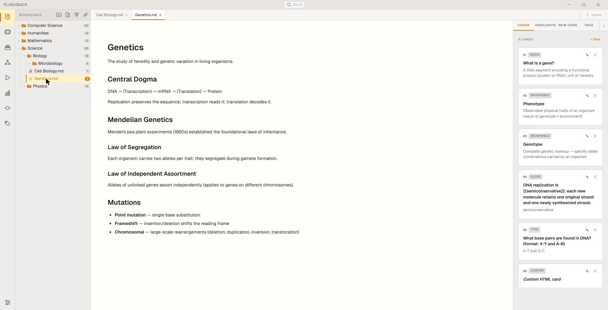
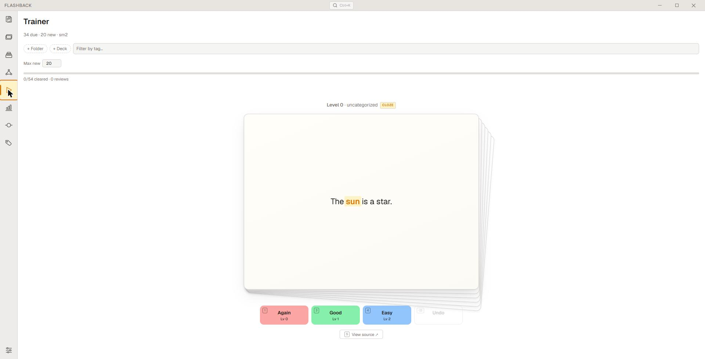
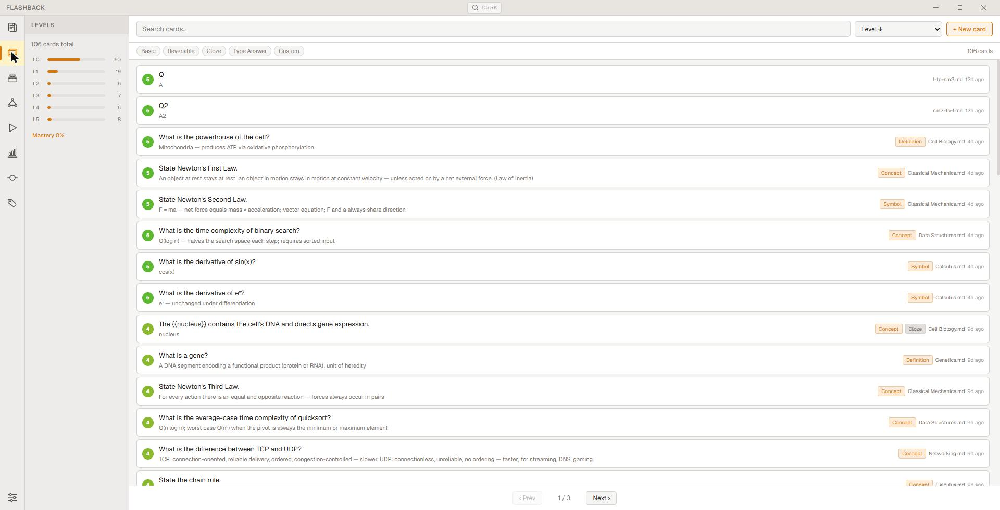
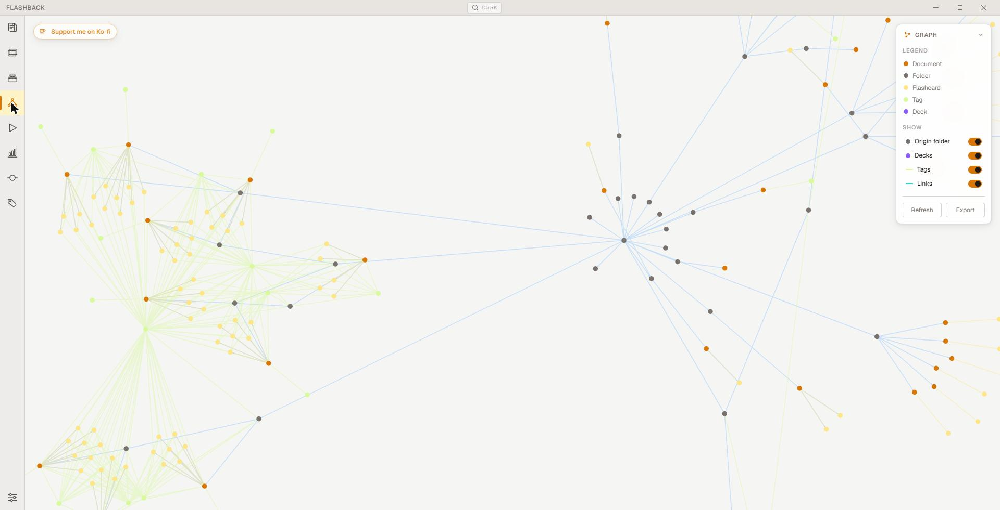
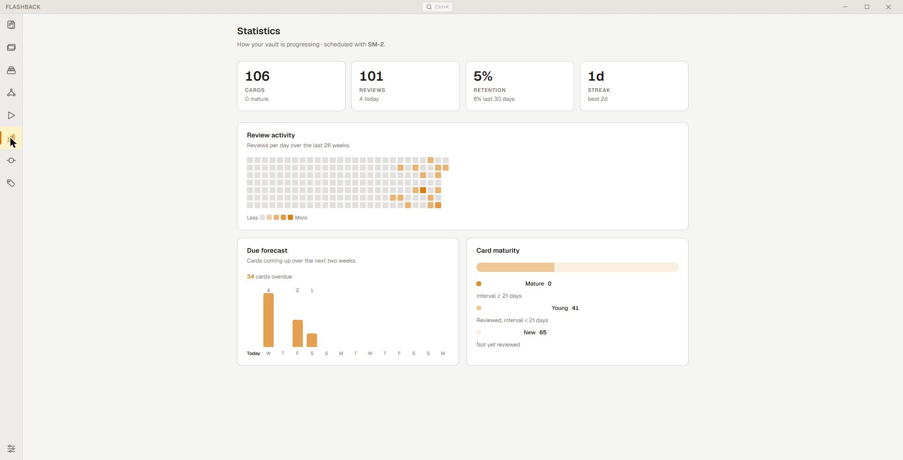

## Overview

Most study tools force a choice: keep your source material in one app and your
flashcards in another. Flashback removes that split. You read your documents —
Markdown, plain text, and PDFs — and create flashcards anchored directly to the
passages they come from. Those anchors survive edits, so the link between what
you read and what you review never breaks.

Everything lives in a self-contained folder of human-readable files
on your own disk. There is no account, no cloud, and no telemetry. A hidden,
git-backed history records every change automatically, so nothing is ever lost.

<p align="center">
  
</p>
<p align="center"><em>Read a source document and build flashcards anchored to it, side by side.</em></p>
---
## Screenshots

<p align="center">
  
</p>
<p align="center"><em>Review due cards with keyboard-driven grading and clear next-interval previews.</em></p>

<p align="center">
  
</p>
<p align="center"><em>Browse and manage every card in the vault, filtered by type, level, or search.</em></p>

<p align="center">
  
</p>
<p align="center"><em>See how documents, folders, cards, tags, and decks connect.</em></p>

<p align="center">
  
</p>
<p align="center"><em>Track retention, workload, and card maturity over time.</em></p>

---

## Features

### Document workspace

- Organize documents inside named, self-contained **vaults** on your local disk.
- A file-tree explorer with folders, drag-and-drop moves, color tags, and
  flashcard-count badges.
- View **Markdown**, **plain text**, and **PDFs**; edit Markdown and text with a
  rich editor. Tabs preserve unsaved drafts as you move around.
- Wiki-style `flashback://` links between documents that survive renames and moves.

### Flashcards

- Five card types — **basic**, **reversible**, **cloze**, **type-answer**, and
  **custom HTML** — each with its own study behavior.
- Cards can be **anchored to a highlight** in a source document, or stand alone.
- Content renders with Markdown and automatic **LaTeX math**; optional image and
  audio on both faces.

### Spaced repetition

- Three scheduling algorithms: **Leitner**, **SM-2**, and **FSRS-6** (with
  vault-specific parameter optimization).
- Scope a study session by folder, deck, tag, or pedagogical-category priority,
  and cap new cards per day.
- Grade by button, keyboard, or swipe, with an **undo** for misgrades.

### Highlights

- Color-coded highlights are first-class, document-scoped objects — independent
  of any card, and reusable by several cards.
- Anchoring adapts per format: inline for Markdown, offset ranges for text, and
  page + region for PDFs.

### Knowledge graph

- A force-directed view of the whole vault: documents, folders, cards, tags, and
  decks, with the relationships between them.
- Toggle layers on and off, and export the graph as PNG, JSON, or a
  self-contained interactive HTML file.

### Organization

- **Decks** — curated collections of cards you can study on their own.
- **Tags** with inheritance down the folder tree, plus per-branch exclusions.
- **Pedagogical categories** that set study priority (Definition, Concept,
  Example, and more).
- A command-palette **search** (`Ctrl+K`) across every folder, document, card,
  tag, and deck.

### Version history

- Every change to your files is committed automatically to a hidden,
  git-compatible history — no manual saves and **no system Git required**.
- Browse the timeline, inspect changes made outside the app, and **roll back** to
  any earlier version, optionally keeping your current review progress.
  
### Learning stats

- Take a look at your stats and see how far you've come on this learning journey
  

### Import

- Import **Anki** decks (`.apkg`) and **Obsidian** vaults; the format is detected
  automatically, with card types, media, tags, and links converted for you.

### Local-first and private

- Fully offline. Your data is plain files you can read, back up, and move.
- No account, no cloud dependency, no telemetry.

### Make it yours

- Several built-in themes plus a custom theme editor with live preview and
  JSON import/export.
- Rebindable keyboard shortcuts and full UI zoom.

---

## Installation

### Download (recommended)

Grab the latest build from the
[**Releases**](https://github.com/WeirdCatAFK/Flashback/releases) page:

- **Windows** — the NSIS installer (`.exe`).
- **Linux** — the `AppImage` (mark it executable and run).

> The current builds are an **unsigned beta**. On Windows, SmartScreen may warn
> before the installer runs; choose *More info → Run anyway*. Signed builds are
> planned.

### Build from source

Requires **Node.js 18+** and npm.

```bash
git clone https://github.com/WeirdCatAFK/Flashback.git
cd Flashback
npm install
npm run electron:rebuild   # compile native modules for Electron
npm run dev                # launch the app with hot reload
```

---

## Built with

Electron · React · Vite · Express · better-sqlite3 · isomorphic-git ·
pdf.js · epub.js · Tiptap · react-force-graph

---

## License

Released under the [GNU GPL v3.0](LICENSE).

<div align="center">
