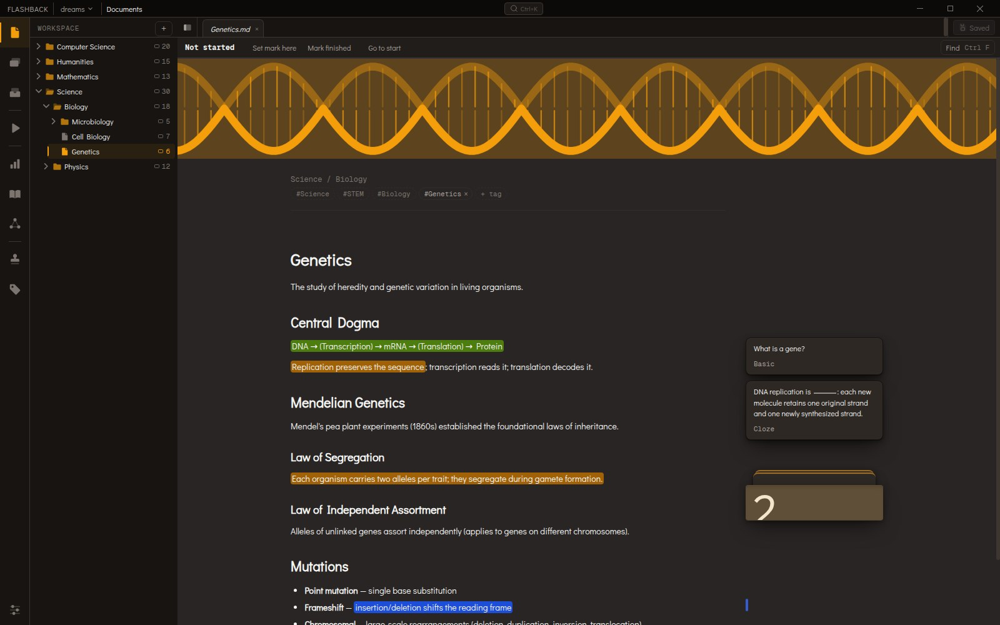
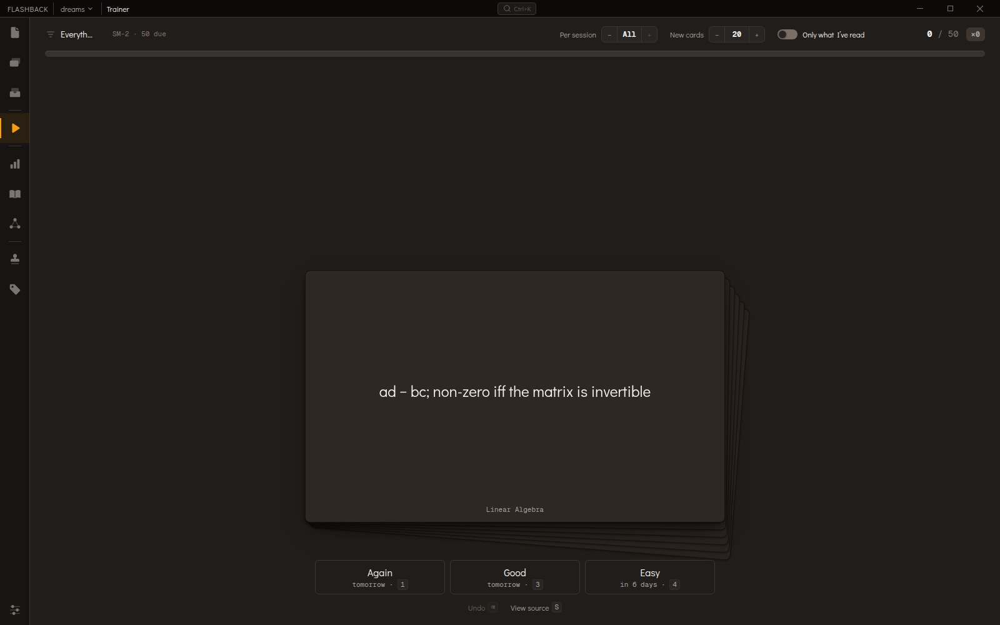
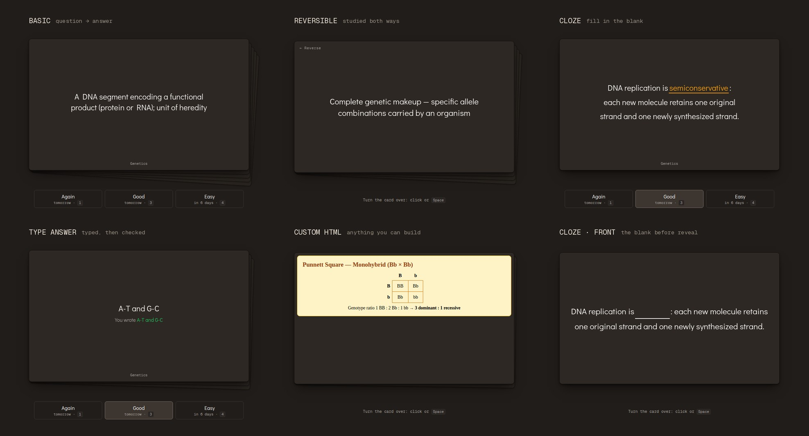
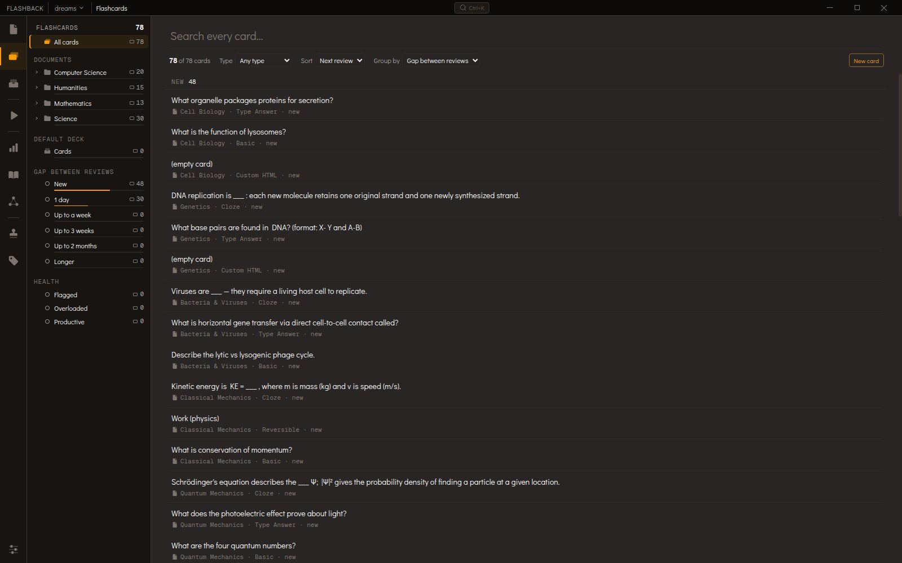
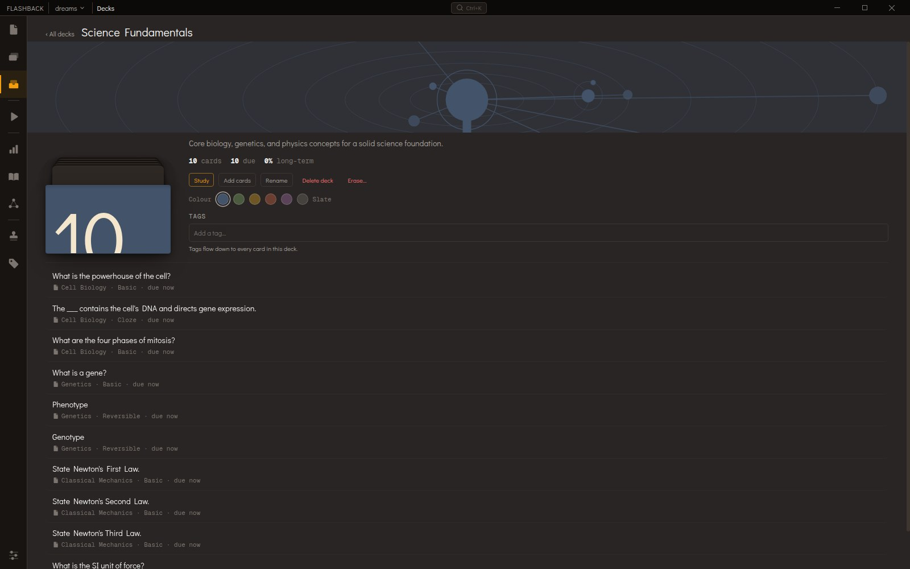
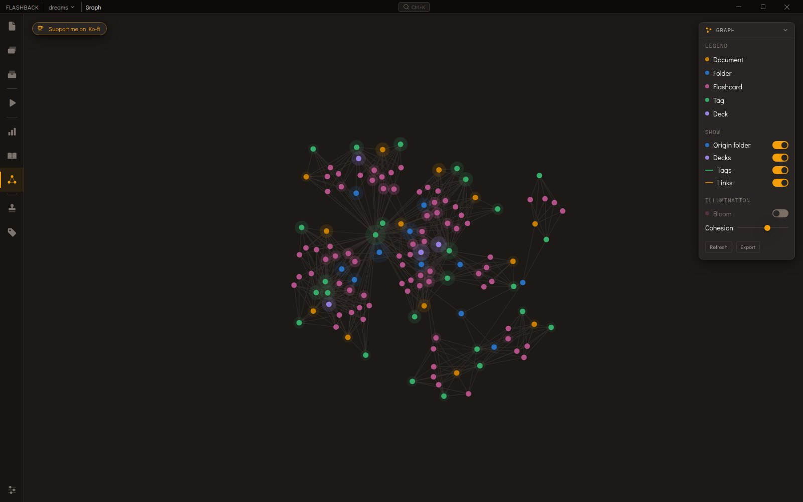
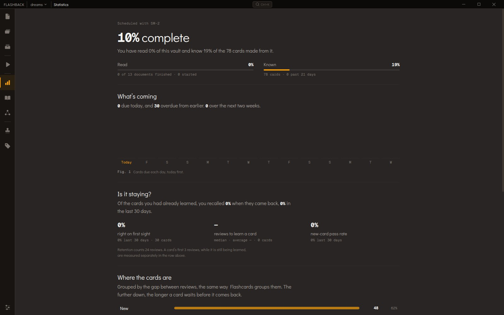
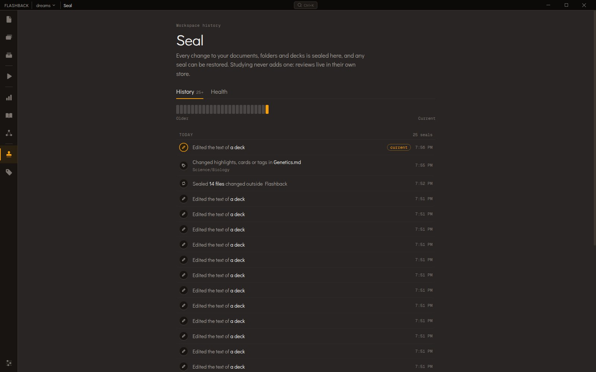
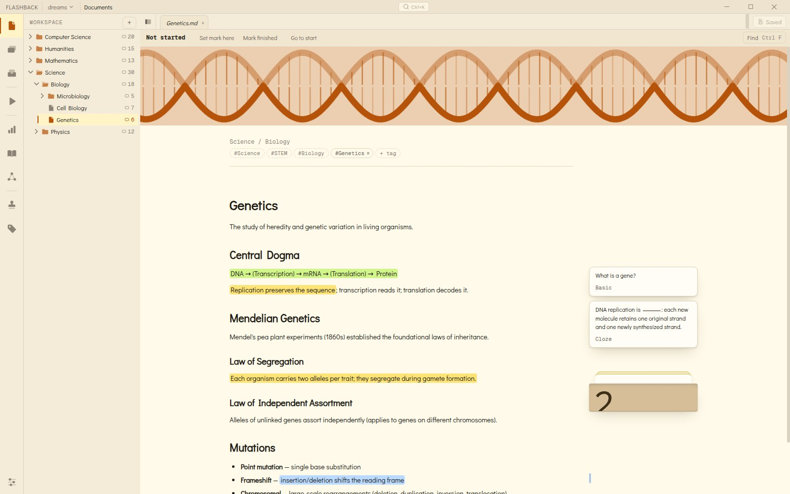

## Overview

Most study tools force a choice: keep your source material in one app and your
flashcards in another. Flashback removes that split. You read your documents
Markdown, plain text, PDFs, EPUBs, web clips and YouTube videos and create
flashcards anchored directly to the passages they come from. Those anchors survive
edits, so the link between what you read and what you review never breaks.

Everything lives in a self-contained folder of human-readable files
on your own disk. There is no account, no cloud, and no telemetry. A hidden,
git-backed history records every change automatically, so nothing is ever lost.

Manage your own long term memorization and learning workspace with flashback

## Screenshots

  

<em>Read a document and keep its flashcards in the margin, right beside the passages they come from.</em>

  

<em>Review due cards on a real index card; each grade button says when it brings the card back.</em>

  

<em>Five card types, each studied its own way: basic, reversible, cloze, type answer, and custom HTML.</em>

  

<em>Every card in the vault, browsable by source document and by the gap between reviews.</em>

  

<em>Decks are boxes of cards in their own colour, with optional covers.</em>

  

<em>See how documents, folders, cards, tags, and decks connect.</em>

  

<em>A short report: how much you've read and know, what's coming, and whether it's staying.</em>

  

<em>Seal keeps every change to your vault, and any point can be restored.</em>

  

<em>Prefer light? Light workbench is there too, alongside four dark themes in Focus and Lamp variants.</em>

---

## Features

### Document workspace

- Organize documents inside named, self-contained vaults on your local disk.
- A file tree with folders, drag-and-drop moves, card counts, and a reading-progress
  line under each document. Hide it to give the page the full width.
- Read Markdown, plain text, PDFs, EPUBs, web clips, and
  YouTube videos (with a clickable, highlightable transcript). Edit Markdown and
  text with a rich editor.
- Each document opens with a head showing its path, tags, and an optional cover:
  upload an image or pick one of 46 drawn covers, many of them animated.
- A reading strip tracks how far you've read, and Find (`Ctrl+F`) lists the
  document's highlights and cards in reading order.
- Wiki-style `flashback://` links between documents that survive renames and moves.
- A rich graph to have a visual understanding of what you've learnt

### Flashcards

- Five card types — basic, reversible, cloze, type-answer, and
  custom HTML — each with its own study behavior.
- Cards can be anchored to a highlight in a source document, or stand alone.
  Anchored cards sit in the margin beside their passage.
- One card editor everywhere, with a live preview beside the fields.
- Content renders with Markdown and automatic LaTeX math; optional image and
  audio on both faces.
- The Flashcards catalogue groups cards by source document and by the gap
  between reviews (new, 1 day, up to a week, … longer), with health filters for
  flagged and overloaded cards.

### Spaced repetition

- Three scheduling algorithms: Leitner, SM-2, and FSRS-6 (with
  vault-specific parameter optimization).
- Scope a study session by folder, deck, tag, or category priority; split long
  queues into batches; cap new cards per day; or study only what you've read.
- Every grade button shows when it brings the card back, and after grading you see
  how the gap changed ("4 d → 8 d").
- Trainer study session optimization by interleaving subjects relative to the graph
