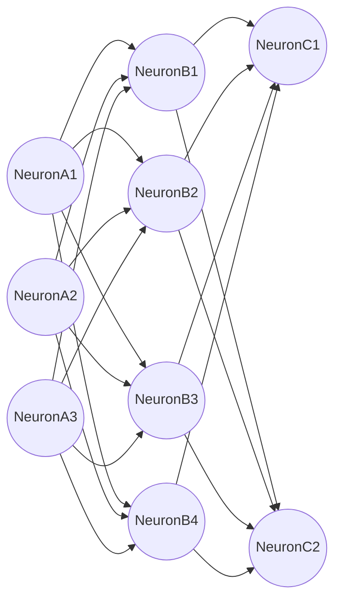
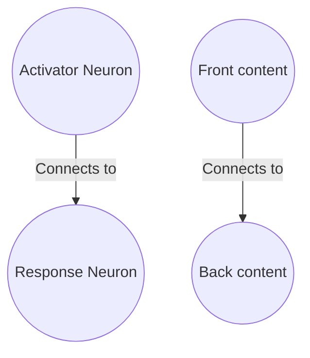

# What is FlashBack?

Flashback is a document annotation tool designed to facilitate the organization and retention of knowledge. It aims to break down information into manageable components (flashcards), enhancing long-term memory and fostering connections between concepts. This tool is centered around creating a graph that mirrors the structure of the human brain.

# How is Flashback built?

# Flashback API

Flashback tries to accomplish something difficult, it takes an unordered structure (your documents) and makes an ordered structure (Your brain graph) to store all the connections, and surely web front end tools are difficult to manage, so most of flashback will be designed to work making API calls to control Files and update the database

So most calls

## Sqlite3 data dictionary

Taking into account that the

| **Table**            | **Column** | **Data Type** | **Description**                                                                   |
| -------------------------- | ---------------- | ------------------- | --------------------------------------------------------------------------------------- |
| **Documents**        | id               | INTEGER             | Unique identifier for the document, primary key.                                        |
|                            | folder_id        | INTEGER             | ID of the folder where the document is located, foreign key from the `Folders` table. |
|                            | name             | VARCHAR             | Name of the document.                                                                   |
|                            | filepath         | VARCHAR             | Filepath of the document.                                                               |
|                            | file_extension   | VARCHAR             | File extension of the document.                                                         |
| **Flashcards**       | id               | INTEGER             | Unique identifier for the flashcard, primary key.                                       |
|                            | document_id      | INTEGER             | ID of the related document, foreign key from the `Documents` table.                   |
|                            | highlight_id     | INTEGER             | ID of the related highlight, foreign key from the `Highlight` table.                  |
|                            | tts_id           | INTEGER             | ID of the related TTS voice, foreign key from the `TTS_voices` table.                 |
|                            | text_renderer_id | INTEGER             | ID of the related text renderer, foreign key from the `Text_renderer` table.          |
|                            | name             | VARCHAR             | Name of the flashcard, it should .                                                      |
|                            | front            | TEXT                | Front text of the flashcard.                                                            |
|                            | back             | TEXT                | Back text of the flashcard.                                                             |
|                            | audio            | VARCHAR             | Filepath for the audio related to the flashcard.                                        |
|                            | presence         | INTEGER             | Presence indicator for the flashcard.                                                   |
|                            | next_recall      | DATETIME            | Date and time for the next recall of the flashcard.                                     |
| **Highlight**        | id               | INTEGER             | Unique identifier for the highlight, primary key.                                       |
|                            | page             | INTEGER             | Page number where the highlight is located.                                             |
|                            | x1               | FLOAT               | X1 coordinate of the highlight on the page.                                             |
|                            | y1               | FLOAT               | Y1 coordinate of the highlight on the page.                                             |
|                            | x2               | INTEGER             | X2 coordinate of the highlight on the page.                                             |
|                            | y2               | INTEGER             | Y2 coordinate of the highlight on the page.                                             |
|                            | start            | INTEGER             | Start position of the highlight in the text.                                            |
|                            | end              | INTEGER             | End position of the highlight in the text.                                              |
| **Inherited_tags**   | id               | INTEGER             | Unique identifier for the inherited tag, primary key.                                   |
|                            | connection_id    | INTEGER             | ID of the connection, foreign key from the `Node_connections` table.                  |
|                            | tag_id           | INTEGER             | ID of the related tag, foreign key from the `Tags` table.                             |
| **Node_connections** | id               | INTEGER             | Unique identifier for the connection, primary key.                                      |
|                            | origin_id        | INTEGER             | ID of the origin node in the connection.                                                |
|                            | destiny_id       | INTEGER             | ID of the destiny node in the connection.                                               |
|                            | relation_type_id | INTEGER             | ID of the relationship type, foreign key from the `Relation_types` table.             |
| **Nodes**            | id               | INTEGER             | Unique identifier for the node, primary key.                                            |
|                            | tag_id           | INTEGER             | ID of the related tag, foreign key from the `Tags` table.                             |
|                            | folder_id        | INTEGER             | ID of the related folder, foreign key from the `Folders` table.                       |
|                            | document_id      | INTEGER             | ID of the related document, foreign key from the `Documents` table.                   |
|                            | flashcard_id     | INTEGER             | ID of the related flashcard, foreign key from the `Flashcards` table.                 |
| **Path**             | id               | INTEGER             | Unique identifier for the path, primary key.                                            |
|                            | name             | VARCHAR             | Name of the path.                                                                       |
| **Path_connections** | id               | INTEGER             | Unique identifier for the path connection, primary key.                                 |
|                            | connection_id    | INTEGER             | ID of the related connection, foreign key from the `Node_connections` table.          |
|                            | path_id          | INTEGER             | ID of the related path, foreign key from the `Path` table.                            |
| **Tags**             | id               | INTEGER             | Unique identifier for the tag, primary key.                                             |
|                            | name             | VARCHAR             | Name of the tag.                                                                        |
| **Text_renderer**    | id               | INTEGER             | Unique identifier for the text renderer, primary key.                                   |
|                            | name             | VARCHAR             | Name of the text renderer.                                                              |
|                            | filepath         | VARCHAR             | Filepath of the text renderer.                                                          |
| **TTS_voices**       | id               | INTEGER             | Unique identifier for the TTS voice, primary key.                                       |
|                            | name             | VARCHAR             | Name of the TTS voice.                                                                  |
|                            | filepath         | VARCHAR             | Filepath of the TTS voice.                                                              |
| **Flashcard_media**  | id               | INTEGER             | Unique identifier for the flashcard media, primary key.                                 |
|                            | flashcard_id     | INTEGER             | ID of the related flashcard, foreign key from the `Flashcards` table.                 |
|                            | front_media_id   | INTEGER             | ID of the related front media, foreign key from the `Media` table.                    |
|                            | back_media_id    | INTEGER             | ID of the related back media, foreign key from the `Media` table.                     |
| **Media**            | id               | INTEGER             | Unique identifier for the media, primary key.                                           |
|                            | filepath         | VARCHAR             | Filepath of the media.                                                                  |
|                            | media_type_id    | INTEGER             | ID of the media type, foreign key from the `Media_types` table.                       |
| **Media_types**      | id               | INTEGER             | Unique identifier for the media type, primary key.                                      |
|                            | name             | VARCHAR             | Name of the media type.                                                                 |
|                            | file_extension   | VARCHAR             | File extension of the media type.                                                       |
|                            | path_js          | VARCHAR             | JavaScript file path associated with the media type.                                    |
| **Relation_types**   | id               | INTEGER             | Unique identifier for the relation type, primary key.                                   |
|                            | name             | VARCHAR             | Name of the relation type.                                                              |
| **Folders**          | id               | INTEGER             | Unique identifier for the folder, primary key.                                          |
|                            | name             | VARCHAR             | Name of the folder.                                                                     |
|                            | filepath         | VARCHAR             | Filepath of the folder.                                                                 |

This table outlines the columns, data types, and a brief description of each column in the schema.

# Why Flashback?

A more bookish storysh approach to explain why all of this

## Your Brain graph

One of the modern challenges of high specialization careers and skill learning it's that most of the knowledge made arround these challenges it's on a language different that the one of your brain, making skill aquisition as hard as it can get, althought there is no correct way of organizing data, most complex non man-made data structures can be represented by graphs, so is our brain, Flashback focusses on the way our brain works to make an specialized data structure that can be easily read by your brain, and my brain, this study method is not new, but I can assure you transforming classic ways to transfer knowledge onto something optimized for learning is time consumming, so on efforts to make this a leaser struggle flashback is my solution to the world, to people who struggle grasping concepts to the people who want to optimze learning

### What is and what isn't your Brain graph

I'd like to say that your brain graph will be your final solution to learning, but it isn't, about a year ago I was talking to one of my proffesor friends at Uni, about how I was planning to make the ultimate learning tool, I would become the most skilled and connossieur of the software engineers on Uni, how I was different and I had everything planned out, apart from other sad conclusions that I adquired that night, one thing was clear **Skill** can't be aquired by **Knowledege** flashback is a tool to optimize knowledge so it can be read and memorized so you can plan the connections between concepts and can plan ahead how you want to understand a topic, but as much as I'd like to say that taking the effort to make a Brain graph will make you more skilled at your job, I worry that this is not what you are looking for, remembering all the recipes from the book will not make you a chef, but it may open your eyes to make you more eager on the kitchen. As a disclaimer, I'd like to add that **Knowledge and memorization** are essential tools to develop a skill, and even if you don't think you need to memorize things, any software engineer will appreciate the discussion of making the data structure more efficient for data retrieval (wink, wink, your brain), so don't be frailed and take responsability on how you design your brain

I'd like to think that most brains work similar to a graph, and they self optimize all the time (How cool is that!) ask any programmer, or psycology student about neurons and they will tell you amazing thins that they can make, heck even right now all that you know is contained on a graph of your brain. The language of the brain is one we can't speak really, but it can make us speak, so taking time to optimize things has an ultimate advantage. Here it's a 3 layered neuron structure

Brains are complex and that's ok, retropropagation, communicator neurons, and self optimizations trough simulations are all ocurrences of the brain, so I want to make something clear. Flashback it's not a 1 to 1 map, it's an abstraction, it's an approach to make all that we know readable to our brains and make it stay present, all the analysis of the graph will be made by inference on where to make new connections and subject inference to face values, the scope of Flashback will be to make a really good map of what we want to stay, and track how much of it has developed on our brains, Flashback will not be doing the optimizations that dreams and late night reflections will do, however it may make the things that you need to remember more present on your life

### Why flashcards?

Flashcards mimic something important on our brains, a pair of neurons, flashcards have to sides of information, the front, and the back, each one exists as itself as a neuron encapsulating one concept, when using flashcards this phenomenon is

Text after graph lol

