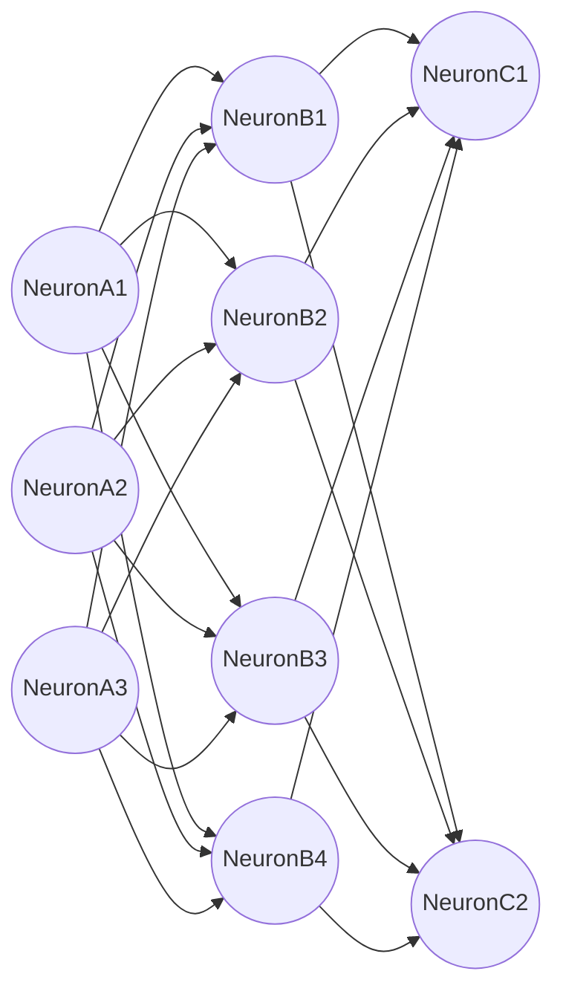
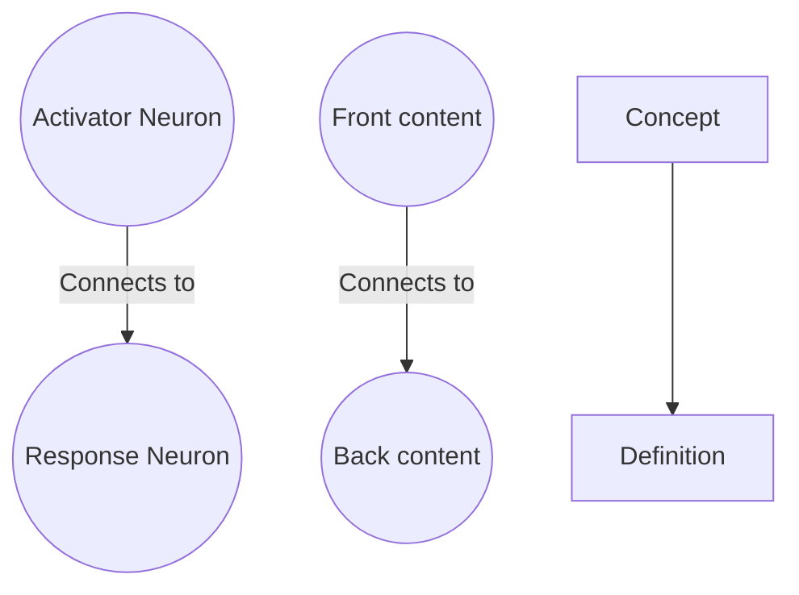
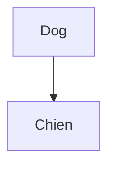
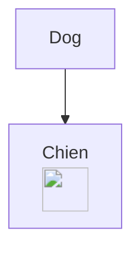
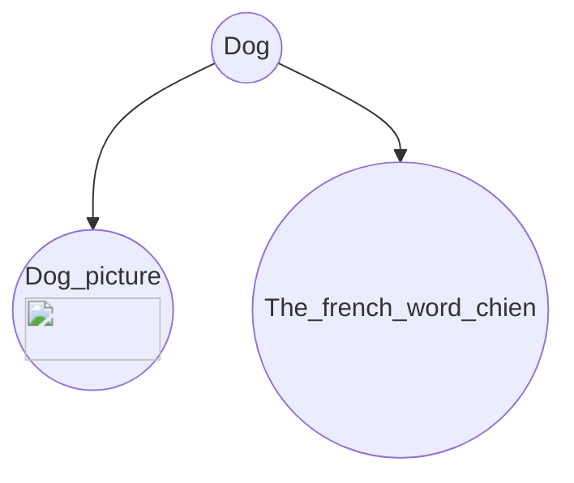
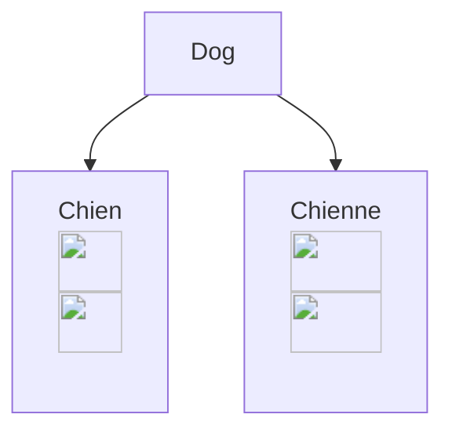
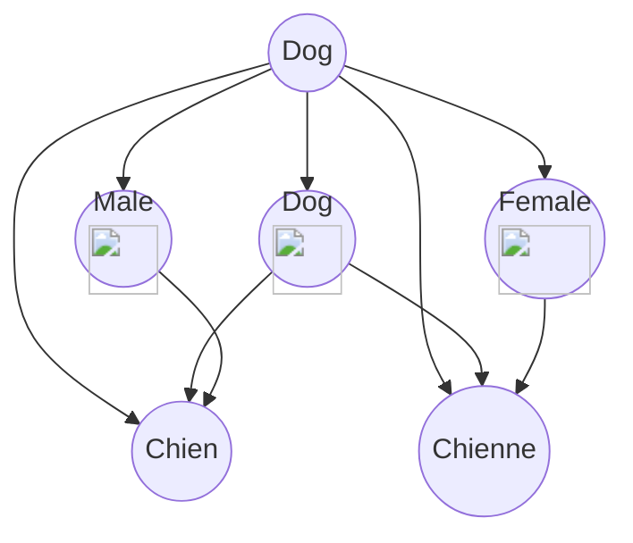
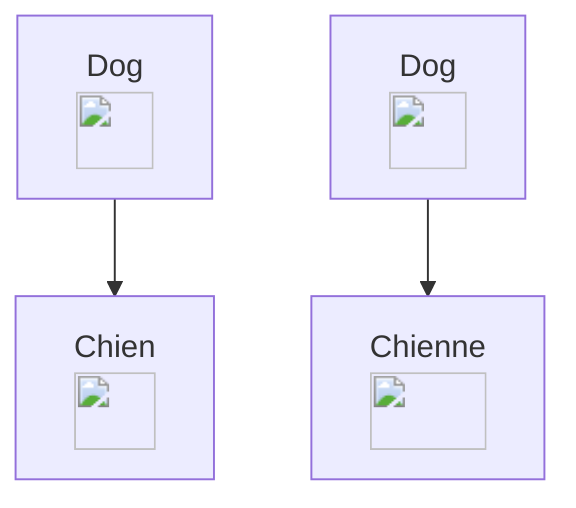
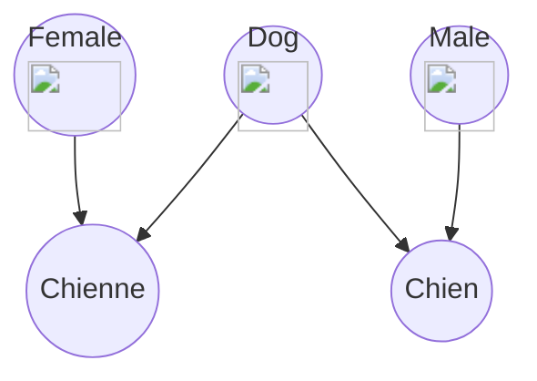

# What is FlashBack?

Flashback is a document annotation tool designed to facilitate the organization and retention of knowledge. It aims to break down information into manageable components (flashcards), enhancing long-term memory and fostering connections between concepts. This tool is centered around creating a graph that mirrors the structure of the human brain.

# How is Flashback built?

Flashback is built on react as it's frontend, electron as an encapsulation tool and an API rest made in express to manage all the file dataFlashback tries to accomplish something difficult, it takes an unordered structure (your documents) and makes an ordered structure (Your brain graph) to store all the connections, and surely web front end tools are difficult to manage, so most of flashback will be designed to work making API calls to control Files and update the database.


## API

### Workspaces

Flashback is an annotation software that has features of a file manager, so the first thing the app does it's to set a workspace as on this document a workspace refers to a directory (folder) on your computer that contains files that will be annotated or modified with flashback. Flashback is meant to be able to hand multiple workspaces, though it may not be the best option to separate what you learn on different spaces, it may help if you are trying to implement a community workspace or simply have multiple people on the same computer, but as for cooperative learning, after making the main app I will spend some time making a server setup for flashback.

Within the api configuration of these workspaces are on the file ``config/data/config.json`` which contains the property ``config`` which contains relevant data for the workspaces, on the next code block, you'll see the default configuration file, when the config json is not readable it defaults to this, flashback is able to handle relative and absolute paths to it's data, so the default workspace is set on a folder ``.flashback``

```javascript
//This is how the default config looks, on workspaces it contains a list with the configuration of all the workspaces
{
    "config": {
        "current": {
            "workspace_id": 0
        },
        "workspaces": [
            {   
                "id": 0,
                "name": "Flashback",
                "description": "This is the default workspace",
                "path": "./.flashback",
                "db": "./data/flashback.db" 	//most db paths will be contained within flashback api on the data folder for convenience,
						//but this path may be changed for naming purposes
            }
        ]
    }
}
```

Check the routes for workspaces 

### Database


| Table Name          | Purpose                                                                                                                                                                    |
| ------------------- | -------------------------------------------------------------------------------------------------------------------------------------------------------------------------- |
| Nodes               | Provides an abstraction, that transforms flashcards, documents, folders and tags to a single type of data, nodes                                                           |
| Folders             | Provides a copy of all the folders on your file tree workspace (Will not update if updated outside the flashback editor)                                                  |
| Documents           | Provides a copy of all the folders on your file tree workspace (Will not update if updated outside the flashback editor)                                                   |
| Flashcards          | Stores all the data of the flashacards made fromthe documents                                                                                                              |
| Flashcard_highlight | Contains some positional values that indicate where a flashcard gets it's information                                                                                      |
| Flashcard_info      | Contains an extension of the flashcard table that is non optimized, it contains the flashcard configuration                                                                |
| Media               | Contains blobs of media to be reconstructed later                                                                                                                          |
| Media_types         | Provides Media info, like file extension and name                                                                                                                          |
| Flashcard_media     | Associates Media with flashcards for loading                                                                                                                               |
| Node_types          | Provides an easier way to access to the node types (ej: tag_node, flashcard_node, document_node or  any special amorfous nodes)                                          |
| Node_connections    | As Nodes it's an abstraction of all your documents, the reason of this abstraction it's to ease the connections representing them as a pair of nodes and a connection type |
| Connection_types    | Provides the type of relationship of nodes, referenced by Node_connections                                                                                                 |
| Inherited_tags      | References a connection to indicate that it's created by a tag that is related to a document so it can be inherited by the flashcards                                      |

Here is the complete design of the database

| Table Name          | Field              | Type     | Constraints                             | Description                                                             |
| ------------------- | ------------------ | -------- | --------------------------------------- | ----------------------------------------------------------------------- |
| Node_types          | id                 | INTEGER  | PRIMARY KEY, AUTOINCREMENT              | Unique identifier for each node type                                    |
|                     | name               | VARCHAR  |                                         | Name of the node type                                                   |
| Nodes               | id                 | INTEGER  | PRIMARY KEY, AUTOINCREMENT              | Unique identifier for each node                                         |
|                     | type_id            | INTEGER  | FOREIGN KEY                             | References Node_types(id)                                               |
|                     | presence           | FLOAT    |                                         | Abstract value representing how present a node is on the graph          |
| Folders             | id                 | INTEGER  | PRIMARY KEY, AUTOINCREMENT              | Unique identifier for each folder                                       |
|                     | name               | VARCHAR  |                                         | Name of the folder                                                      |
|                     | filepath           | VARCHAR  |                                         | File path of the folder                                                 |
|                     | node_id            | INTEGER  | FOREIGN KEY                             | References Nodes(id), ON DELETE CASCADE                                 |
| Documents           | id                 | INTEGER  | PRIMARY KEY, AUTOINCREMENT              | Unique identifier for each document                                     |
|                     | folder_id          | INTEGER  | FOREIGN KEY                             | References Folders(id), ON DELETE CASCADE                               |
|                     | name               | VARCHAR  |                                         | Name of the document                                                    |
|                     | filepath           | VARCHAR  |                                         | File path of the documents                                              |
|                     | file_extension     | VARCHAR  |                                         | File extension of the document                                          |
|                     | node_id            | INTEGER  | FOREIGN KEY                             | References Nodes(id), ON DELETE CASCADE                                 |
| Flashcard_highlight | id                 | INTEGER  | PRIMARY KEY, AUTOINCREMENT              | Unique identifier for each flashcard highlight                          |
|                     | page               | INTEGER  |                                         | Page number of the highlight                                            |
|                     | x1                 | FLOAT    |                                         | X-coordinate of the starting point for non text based files             |
|                     | y1                 | FLOAT    |                                         | Y-coordinate of the starting point for non text based files            |
|                     | x2                 | FLOAT    |                                         | X-coordinate of the ending point for non text based files              |
|                     | y2                 | FLOAT    |                                         | Y-coordinate of the ending point for non text based files              |
|                     | start              | INTEGER  |                                         | Starting position of the highlight for text based files                 |
|                     | end                | INTEGER  |                                         | Ending position of the highlight for text based files                  |
| Flashcards          | id                 | INTEGER  | PRIMARY KEY, AUTOINCREMENT              | Unique identifier for each flashcard                                    |
|                     | document_id        | INTEGER  | FOREIGN KEY                             | References Documents(id), ON DELETE CASCADE                             |
|                     | node_id            | INTEGER  | FOREIGN KEY                             | References Nodes(id), ON DELETE CASCADE                                 |
|                     | highlight_id       | INTEGER  | FOREIGN KEY                             | References Flashcard_highlight(id), ON DELETE SET NULL                  |
|                     | name               | VARCHAR  |                                         | Name of the flashcard                                                   |
|                     | front              | TEXT     |                                         | Front side content of the flashcard                                     |
|                     | back               | TEXT     |                                         | Back side content of the flashcard                                      |
|                     | audio              | VARCHAR  |                                         | Audio file associated with the flashcard                                |
|                     | next_recall        | DATETIME |                                         | Next scheduled recall date/time for the flashcard                       |
| Flashcard_info      | id                 | INTEGER  | PRIMARY KEY, AUTOINCREMENT              | Unique identifier for each flashcard info entry                         |
|                     | flashcard_id       | INTEGER  | FOREIGN KEY                             | References Flashcards(id), ON DELETE CASCADE                            |
|                     | text_renderer      | VARCHAR  |                                         | Text renderer used for the flashcard                                    |
|                     | tts_voice          | VARCHAR  |                                         | Text-to-speech voice used for the flashcard                             |
| Media_types         | id                 | INTEGER  | PRIMARY KEY, AUTOINCREMENT              | Unique identifier for each media type                                   |
|                     | name               | INTEGER  |                                         | Name of the media type                                                  |
|                     | file_extension     | VARCHAR  |                                         | File extension associated with the media type                           |
| Media               | id                 | INTEGER  | PRIMARY KEY, AUTOINCREMENT              | Unique identifier for each media item                                   |
|                     | media              | BLOB     |                                         | Binary data of the media item                                           |
|                     | media_type_id      | INTEGER  | FOREIGN KEY                             | References Media_types(id)                                              |
| Flashcard_media     | id                 | INTEGER  | PRIMARY KEY, AUTOINCREMENT              | Unique identifier for each flashcard media association                  |
|                     | flashcard_id       | INTEGER  | FOREIGN KEY                             | References Flashcards(id), ON DELETE CASCADE                            |
|                     | front_media_id     | INTEGER  | FOREIGN KEY                             | References Media(id), ON DELETE SET NULL                                |
|                     | back_media_id      | INTEGER  | FOREIGN KEY                             | References Media(id), ON DELETE SET NULL                                |
| Tags                | id                 | INTEGER  | PRIMARY KEY, AUTOINCREMENT, FOREIGN KEY | Unique identifier for each tag, References Nodes(id), ON DELETE CASCADE |
|                     | name               | VARCHAR  |                                         | Name of the tag                                                         |
| Connection_types    | id                 | INTEGER  | PRIMARY KEY, AUTOINCREMENT              | Unique identifier for each connection type                              |
|                     | name               | VARCHAR  |                                         | Name of the connection type                                             |
| Node_connections    | id                 | INTEGER  | PRIMARY KEY, AUTOINCREMENT              | Unique identifier for each node connection                              |
|                     | origin_id          | INTEGER  | FOREIGN KEY                             | References Nodes(id), ON DELETE CASCADE                                 |
|                     | destiny_id         | INTEGER  | FOREIGN KEY                             | References Nodes(id), ON DELETE CASCADE                                 |
|                     | connection_type_id | INTEGER  | FOREIGN KEY                             | References Connection_types(id)                                         |
| Inherited_tags      | id                 | INTEGER  | PRIMARY KEY, AUTOINCREMENT              | Unique identifier for each inherited tag                                |
|                     | connection_id      | INTEGER  | FOREIGN KEY                             | References Node_connections(id), ON DELETE CASCADE                      |
|                     | tag_id             | INTEGER  | FOREIGN KEY                             | References Tags(id), ON DELETE CASCADE                                  |
| Path                | id                 | INTEGER  | PRIMARY KEY, AUTOINCREMENT              | Unique identifier for each path                                         |
|                     | name               | VARCHAR  |                                         | Name of the path                                                        |
| Path_connections    | id                 | INTEGER  | PRIMARY KEY, AUTOINCREMENT              | Unique identifier for each path connection                              |
|                     | connection_id      | INTEGER  | FOREIGN KEY                             | References Node_connections(id), ON DELETE CASCADE                      |
|                     | path_id            | INTEGER  | FOREIGN KEY                             | References Path(id), ON DELETE CASCADE                                  |

# Why Flashback?

A more bookish storish approach to explain why flashback is this way, and why i want to make flashback

## Your Brain graph

One of the modern challenges of high specialization careers and skill learning it's that most of the knowledge made arround these challenges it's on a language different that the one of your brain, making skill aquisition as hard as it can get, althought there is no correct way of organizing data, most complex non man-made data structures can be represented by graphs, so is our brain, Flashback focusses on the way our brain works to make an specialized data structure that can be easily read by your brain, and my brain, this study method is not new, but I can assure you transforming classic ways to transfer knowledge onto something optimized for learning is time consumming, so on efforts to make this a leaser struggle flashback is my solution to the world, to people who struggle grasping concepts to the people who want to optimize learning and absorbing information

### What is and what isn't your Brain graph

I'd like to say that your brain graph will be your final solution to learning, but it isn't, about a year ago I was talking to one of my proffesor friends at Uni, about how I was planning to make the ultimate learning tool, I would become the most skilled and connossieur of the software engineers on Uni, how I was different and I had everything planned out, apart from other sad conclusions that I adquired that night, one thing was clear **Skill** can't be aquired by **Knowledege** flashback is a tool to optimize knowledge so it can be read and memorized, you can plan the connections between concepts and plan ahead how you want to understand a topic, but as much as I'd like to say that taking the effort to make a Brain graph will make you more skilled at your job, I worry that this is not what you are searching for, remembering all the recipes from the book will not make you a chef, but it may open your eyes to make you more eager on the kitchen. As a disclaimer, I'd like to add that **Knowledge and memorization** are essential tools to develop a skill, and even if you don't think you need to memorize things, any software engineer will appreciate the discussion of making the data structure more efficient for data retrieval (wink, wink, your brain), so don't be frailed and take responsability on how you design your brain

I'd like to think that most brains work similar to a graph, and they self optimize all the time (How cool is that!) ask any programmer, or psycology student about neurons and they will tell you amazing things that they can make, heck even right now all that you know is contained on a graph of your brain. The language of the brain is one we can't speak really, but it can make us speak, so taking time to optimize things has an ultimate advantage. Here it's a 3 layer neuron structure just to show how complex your brain can wire your thoughts



Brains are complex and that's ok, retropropagation, communicator neurons, and self optimizations trough simulations are all ocurrences of the brain, the computational hability to use 3 layered neural networks to work efficiently it's practically a new occurrence, since we've been teaching rocks how to think, so I want to make something clear. Flashback it's not a 1 to 1 map, it's an abstraction, it's an approach to make all that we know readable to our brains and make it stay present, all the analysis of the graph will be made by inference on where to make new connections and subject inference to face values, the scope of Flashback will be to make a really good map of what we want to stay, and track how much of it has developed on our brains, Flashback will not be doing the optimizations that dreams and late night reflections will do, however it may make the things that you need to remember more present on your life. Ultimately flashback is a readable set of instructions

### Why flashcards?

Flashcards mimic something important in our brains—a pair of neurons. Flashcards have two sides of information: the front and the back. Each side represents a concept, similar to how neurons encapsulate information. By using flashcards, this phenomenon can be trained into our brains because proper exposure to them strengthens connections in a way that mirrors how our brain graph functions.



While explaining to my friends how to create the right paths for building connections, an epiphany struck me: the best way to design flashcards is to incorporate multiple activator and response neurons. Here's an example:

Let’s suppose we want to learn French, and we create a simple card to remember the translation of the word "dog."



This simple flashcard is useful, of course, but it only helps you remember that "Dog" means "Chien." This presents a learning problem because you’re not connecting the word "Chien" to the concept of a dog. So, with a bit more effort, we can create a flashcard with multiple activator neurons. First, let’s bridge the gap between the word "Dog" and the *concept* of a dog. We can address this by adding a picture of a dog:



Now, our neuron mapping looks like this:



We’ve created a multi-connection flashcard by simply adding the picture of a dog. Now, when recalling the word "Dog," we’ll also remember that in French, dogs are called "Chiens." But wait—actually, not all dogs. French is a gendered language. This doesn't mean what you might think; it refers to the grammatical classification of words into groups that affect pronunciation where the identificators of gender are on different phonetical classification for ease of recognition

To capture this, we need to modify our flashcard to remember that a masculine dog is "chien," and a feminine dog is "chienne." Let's create new flashcards:



Now we have a flashcard containing both concepts. However, this isn't entirely efficient. When the activator neuron for "Dog" is triggered, you'll relate it to both "chien" and "chienne," which could blur the distinction between them. Here’s how this neuron mapping looks:



If you're a programmer, you might notice an issue: this looks like a decision tree. But is not exactly a decision tree, and that's the problem. In decision trees or simple logistic models, relationships are often built around containers (in this case, "dog"). However, when optimizing your brain graph, it’s important to remember that all neurons in an efficient neuron map should be entry points to the graph. So, we need to rethink how we design flashcards. Here’s a better approach:



This is a multi-neuron entry flashcard, which essentially means two flashcards for two different concepts. Now, let's examine the neuron mapping:



It may look simpler, but the simpler the graph, the easier it is to traverse. What's remarkable is that the front of the flashcard can be any activator neuron, and there are no unnecessary connections. When you are exposed to the word "Dog," both "Chien" and "Chienne" neurons will activate. However, if you're exposed to the concept of a female dog, both the "Female" and "Dog" neurons will fire, with "Chienne" being activated more strongly than "Chien," and vice versa. So try to make your flashcards with as many activator neurons as you can, since these will help you optimize your own mind for faster clarity of concepts
