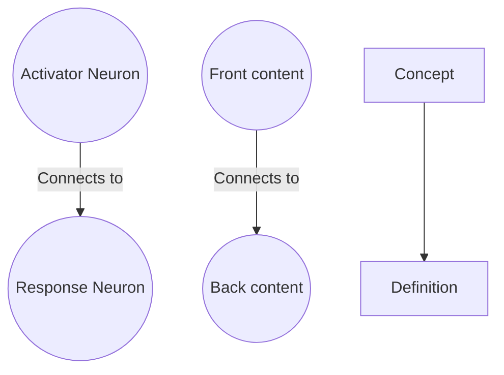
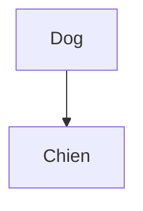
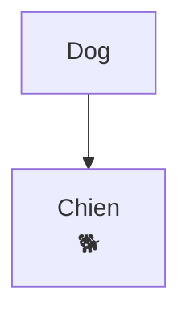
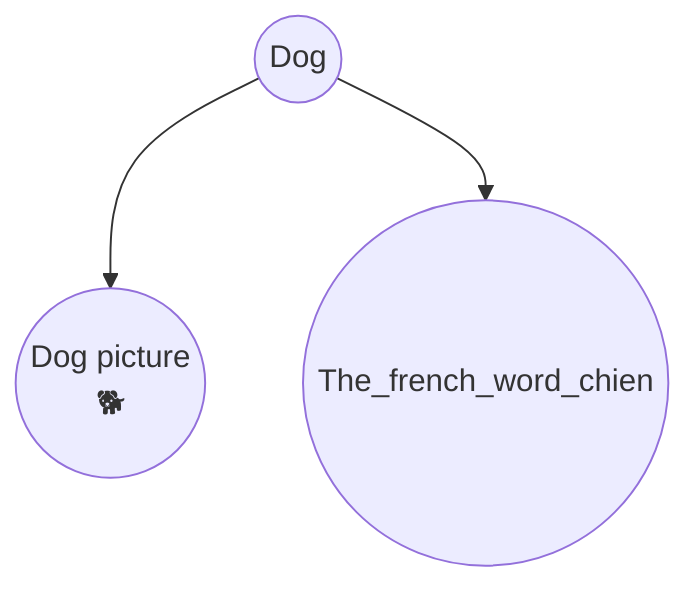
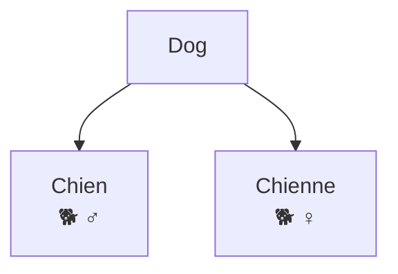
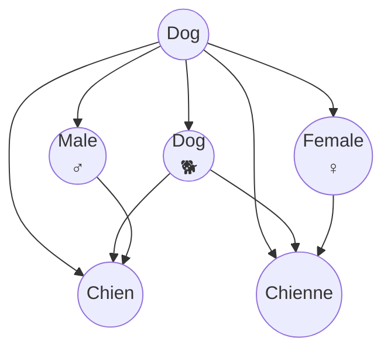
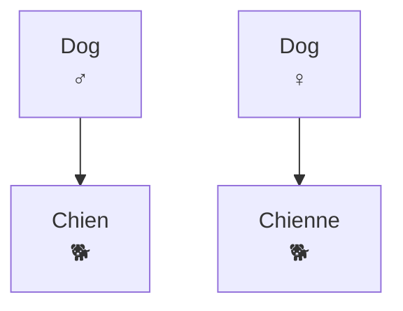
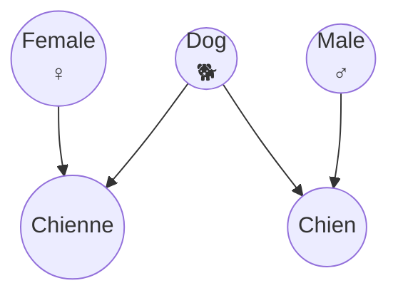

---

## name: flashback-cards

description: Author, diagnose, and repair flashcards in the Flashback vault (spaced repetition + knowledge graph app) so they survive long-interval review — decomposing material into atomic, precisely-cued prompts and creating them through the Flashback MCP tools. Use this whenever the user asks to make, add, generate, fix, rewrite, or review flashcards, cards, prompts, or a deck in Flashback, or asks to turn a document, book, chapter, article, video, or topic into study material, even if they only say "make me some cards on X" or "card this chapter." Also use when the user says cards feel too hard, keep lapsing, are "a mouthful," or when they want to know whether a deck is well built. New cards are made only from the user's own highlights.

One of the modern challenges of high specialization careers and skill learning it's that most of the knowledge made arround these challenges it's on a language different that the one of your brain, making skill aquisition as hard as it can get, althought there is no correct way of organizing data, most complex non man-made data structures can be represented by graphs, so is our brain, Flashback focusses on the way our brain works to make an specialized data structure that can be easily read by your brain, and my brain, this study method is not new, but I can assure you transforming classic ways to transfer knowledge onto something optimized for learning is time consumming, so on efforts to make this a leaser struggle flashback is my solution to the world, to people who struggle grasping concepts to the people who want to optimize learning and absorbing information. Flashback is a tool to optimize knowledge so it can be read and memorized, you can plan the connections between concepts and plan ahead how you want to understand a topic, but as much as I'd like to say that taking the effort to make a Brain graph will make you more skilled at your job, I worry that this is not what you are searching for, remembering all the recipes from the book will not make you a chef, but it may open your eyes to make you more eager on the kitchen. As a disclaimer, I'd like to add that **Knowledge and memorization** are essential tools to develop a skill, and even if you don't think you need to memorize things, any software engineer will appreciate the discussion of making the data structure more efficient for data retrieval (wink, wink, your brain), so don't be frailed and take responsability on how you design your brain

I'd like to think that most brains work similar to a graph, and they self optimize all the time (How cool is that!) ask any programmer, or psycology student about neurons and they will tell you amazing things that they can make, heck even right now all that you know is contained on a graph of your brain. The language of the brain is one we can't speak really, but it can make us speak, so taking time to optimize things has an ultimate advantage. Here it's a 3 layer neuron structure just to show how complex your brain can wire your thoughts

# Authoring Flashback cards

## The governing constraint

A card is a recurring task you are handing to a person for the next several years. Card design is task design. The cost of a badly formulated card is not one bad review it is a card that lapses indefinitely, drags the scheduler, and eventually makes the user resent the deck.

Everything below follows from one rule:

**One card, one retrieval.** If answering correctly requires recalling two things that can be forgotten independently, it is two cards.

"One retrieval" means one *chunk*, not one token. A chunk can be several words long — tail -n 10 file.txt is retrieved as a single motion by anyone who knows tail. What breaks a card is composing chunks the user does not yet hold together, behind a single binary grade.

Two reasons this matters more in Flashback than in a generic SRS:

1. **Memory mechanics.** Simple items rest on a single connection that review refreshes uniformly. Complex items get partially activated, in an order that shifts with context, so no review strengthens the whole thing evenly. This is Wozniak's minimum information principle, and it is the most load-bearing idea in card design.
2. **Signal quality.** Grading is binary. A card carrying five facts is graded as one, so the ReviewLog cannot record which fact failed, and the scheduler reschedules all five on the strength of the weakest. Since Flashback's longer-term ambition is to use retention data as a quality signal, bundled cards do not merely study badly — they corrupt the measurement.

## Step 0 — read the vault before writing anything

In this order, every time:

1. list_categories — valid category names. An unrecognized value is rejected, not silently dropped.
2. list_cards with origin: "human" — the handmade cards are the style specifications. Match their length, phrasing, and cue conventions rather than inventing a house style.
3. list_decks — locate the target deck. Note whether a new one is needed.
4. list_cards with sortBy: "lapses" — cards the user keeps failing. A high-lapse card is nearly always a formulation problem, not a memory problem. Offer to rewrite them; this is often more valuable than adding new cards.
5. If carding a document: list_highlights with uncardedOnly: true, then read the body around them. The user's highlights are their declaration of what matters, and **they are the only material you card**: create_flashcard requires the highlightHash of one of them, and nothing here can make a highlight. Read as widely as you need for context — the paragraph before a highlight often decides what the card should ask — but a passage the user did not highlight is not a target. When they ask for cards on something unhighlighted ("card this chapter", "make me some cards on X"), say which passages you would card and ask them to highlight those in the app; then card the highlights. This keeps every AI card on something the user chose and under their eye, and it is why cards are never mass-produced from a document. This is to not envourage the user to make more cards that they can take, effort is based on creating quality cards, not covering quickly, even for a day recommend creating a maximum of 20 cards, if the user insists more can be done, but alert them about generating more that they can manage, we rather not cram.
   **Reading the body.** read_document returns content for Markdown, plain text, and .clip/.youtube stubs, plus the sidecar (existing cards, tags, highlights) for everything. For a PDF, EPUB, image, audio, or video it returns content: null — this is **not** a dead end. Call read_document_text with the same path: it extracts and paginates server-side, addressed by format. PDFs by page number, EPUBs by spine section number or href, YouTube transcripts by segment (or at = seconds to jump to a moment). Start with path alone, then follow next until hasMore is false, and nextCharOffset when a unit comes back truncated. Each response carries a label like "p. 37" or a timestamp — cite it when a card comes from a specific place.
   **Its pictures and sound.** Text extraction returns prose only, so a document's media comes from its own tools: list_book_images for an EPUB, list_clip_media for a saved web clip (which also holds any short audio the page had). Both list metadata — alt text, caption, the section or heading it sits under — so you can usually tell which figure is which without looking; view_book_image/view_clip_image when you can't. Put one on a card with attach_book_image/attach_clip_media. This is worth a call on any illustrated source: see *adding non-redundant cues* below for why a real diagram beats a description of one, and note that a pronunciation recording is the only honest front for a pronunciation card.
   Two real limits: scanned PDFs have no text layer and return nothing, and search_content only covers .md/.txt bodies, so a miss there is not evidence the vault lacks a topic — check highlights and existing cards on the media documents too.

## The house style

Read from the handmade cards, and worth preserving:

* **Fronts are terse task descriptions, can be prose questions.** Initialize a git repository, or What is the command you would use to create a new repository in the current directory? Each card needs a specific context to be a task or a question. See which does the user do best.
* **Concrete literals go in parentheses at the end of the front.** Git command to stage a file (readme.md) → git add readme.md. This is an elegant convention: it pins the exact expected answer without inflating the sentence the user has to parse.
* **type_answer answers are the bare artifact.** No trailing prose, no explanation, no parenthetical in answerText — it is compared literally, so anything extra is a way to fail a card the user knew. Explanation that belongs *with* this card goes in backText, which is shown after checking and never compared (a mnemonic, a why); explanation that stands on its own belongs on a separate basic card.
* **Symbol cards are irreducible pairs.** あ → a. Nothing to decompose further. This is the target shape; the further a card is from it, the more justification it needs.
* **Context indicators.** Cards can coallesce into the same questions in different contexts ej: Get directory contents → [bash] ls or → [PowerShell]Get-ChildItem. Same question different answers, preferably start these questions with brackets indicating the context to make a quick lookup for the user which doesn't grab their attention. [bash] Get directory contents → ls, [Powershell] Get directory contents → Get-ChildItem. Not all cards require a context indicator, but some like instruction sets or vague questions need one to prevent confusion

## Choosing targets, then writing prompts

These are two separate jobs. Do them in order and do not merge them, merging is how you end up writing a prompt for whatever sentence you happen to be looking at.

**First, choose targets.** Read the material and mark the specific pieces worth being able to recall. Not everything is a target: things the user already knows, things trivially inferable from what they know, and things they will never need cold are all correctly skipped. The user's highlights are the target list a highlight may hold several targets, but nothing outside the highlights is one.

**Then, write one or more prompts per target.** How depends on the kind of knowledge — factual, procedural, or conceptual. See references/knowledge-types.md for worked patterns for each, including closed vs. open lists and the conceptual lenses (attributes, similarities/differences, parts/wholes, causes/effects, significance).

For sets larger than roughly ten cards, show the user the target list before drafting the cards. Targets are cheap to correct; cards are not. You might want to walk with the user on defining a mental model of what are we trying to keep or with what purpose in order to make content the user can actually use. ej: a bunch of cards listing individual git commands could use some clarifying questions on the mental models of git (branches, working tree, staging area, merges, etc) clarifying these pieces of context relative to the cards you are producing might yield better results.

## Card type selection

| Type            | Use for                                                                                                                                                                                                           |
| --------------- | ----------------------------------------------------------------------------------------------------------------------------------------------------------------------------------------------------------------- |
| `type_answer` | Production of a short exact artifact the user must type from memory: a command, an operator, a keyword, a kana, a signature fragment.`answerText` is graded; `backText` is optional notes revealed afterwards |
| `basic`       | Anything graded by judgment: explanations, distinctions, "why", tradeoffs, heuristics                                                                                                                             |
| `cloze`       | A target embedded in a structure where seeing the structure is itself part of the knowledge — a slot in a statement, an item in a closed list. Blanks in`{{double braces}}`                                    |
| `reversible`  | Irreducible symmetric pairs only (term ↔ symbol, word ↔ translation). Skip it when one direction is far easier than the other                                                                                   |
| `custom`      | Raw HTML, for layout that carries meaning — tables, positioned diagrams                                                                                                                                          |

Default to type_answer for production and basic for understanding. Cloze is fast to write and mnemonically strong, but it is the format most vulnerable to pattern matching: with a long or distinctive sentence, the user learns the shape of the sentence rather than the knowledge. Keep cloze sentences short and generic.

## Five properties, checked before saving

* **Focused** — one detail. Excess detail dulls attention and produces incomplete retrievals.
* **Precise** — unambiguous about what is being asked for. Vague questions produce vague answers.
* **Consistent** — the same answer every time. Otherwise related-but-unrecalled knowledge is actively inhibited (retrieval-induced forgetting).
* **Tractable** — answerable nearly always. If it is not, break it down or add a cue.
* **Effortful** — the answer must actually be retrieved, not inferred from the question.

Then two litmus tests:

**False positive: could the answer be produced without knowing the thing?** Long questions with distinctive wording get memorized as shapes. Cues that narrow to one possible answer give it away.

**False negative: could the user know the thing and still be marked wrong?** This is the one that kills syntax cards, and it has a reliable tell:

> If you find yourself appending a hint so that only your intended answer fits — "…using a range test", "…using a set membership test" — the front is asking for a *task outcome* when the target is a *specific construct*. Name the construct in the front instead of hinting at it. See "When several constructs satisfy the same task" below.

## Syntax, command, and code cards

This is where cards most often fail, so it gets explicit rules.

### The answer is one chunk, not one token

Production cards exist to build motor memory for things the user will actually type. That means the answer should be **a whole invocation they would really run** not a decomposed fragment. tail -n 10 file.txt and Get-ChildItem -Recurse -Filter *.txt are correct answer shapes. Reducing them to -n or -Recurse destroys exactly what the card is for.

The unit is one *chunk*: a piece the user can already hold as a single thought. A chunk may be several tokens. rm -r build is one chunk — command, its idiomatic flag, its argument, retrieved together. What is not acceptable is a *composition of independent chunks* behind one grade.

The size of a chunk is a property of the learner, not the material. As fluency grows, what was three chunks becomes one, and cards should grow with it. So this is a ladder, not a fixed rule: write production cards at the largest size the user can currently retrieve in one motion.

### Front length is the real constraint

Compare two real cards from the vault. Both have multi-token answers; only one works.

> **Works** (level 4) — Front: [Bash] Show the last 10 lines of file.txt → Back: tail -n 10 file.txt
> **Stalled** (level 0) — Front: [SQL] Return all columns, matching each orders row to customers where orders.customer_id equals customers.id, keeping only rows that match in both tables → Back: SELECT * FROM orders INNER JOIN customers ON orders.customer_id = customers.id;

The answers are comparable. The fronts are not: eight words versus twenty-six. A long front is a specification the user must decode before retrieval even starts, and decoding competes with recall. **Keep fronts to roughly a dozen words, phrased as a task, with concrete values supplied compactly.** There are exceptions of course but is a general rule of thumb

### When several constructs satisfy the same task, name the construct

Shell tasks usually have one idiomatic answer, so a plain task description is unambiguous. Expressive languages are different: "rows where total is between 50 and 100" is satisfied by BETWEEN and by >= AND <= equally. This is a property of the language, not a defect in the card — and the fix is to put the construct in the front rather than bolting on a disambiguating hint.

Use the vault's existing convention: construct plus a compact parameter list.

| Front                                                                                    | Back                                                                                |
| ---------------------------------------------------------------------------------------- | ----------------------------------------------------------------------------------- |
| `[SQL] BETWEEN filter on orders.total (50, 100)`                                       | `SELECT * FROM orders WHERE total BETWEEN 50 AND 100;`                            |
| `[SQL] INNER JOIN orders to customers (orders.customer_id, customers.id), all columns` | `SELECT * FROM orders INNER JOIN customers ON orders.customer_id = customers.id;` |

Whole statements preserved, motor memory intact, fronts cut by two thirds, ambiguity gone.

### When a whole statement really is too big, scaffold — don't replace

If the user keeps lapsing on a full-statement card, the sub-chunks underneath it are not yet mature. Add smaller cards for the weak pieces **alongside** the full one, and let the full one climb as its parts strengthen. Deleting it and keeping only fragments trains recognition instead of production, which is the opposite of the goal.

### Strip characters that carry no knowledge

Trailing semicolons, optional aliases, cosmetic whitespace, arbitrary casing: each is a way to fail a card the user actually knew. Keep the answer to the canonical minimum. Confirm how type_answer grades — if the comparison is exact, this is not cosmetic advice, it is the difference between a usable deck and an infuriating one.

### Fix the schema across a deck

When syntax cards need table and column names, use the same ones on every card in the deck. Otherwise the user is recalling arbitrary identifiers alongside the actual knowledge, and each card carries a private vocabulary.

## Multiple activator cues

Flashcards mimic something important in our brains—a pair of neurons. Flashcards have two sides of information: the front and the back. Each side represents a concept, similar to how neurons encapsulate information. By using flashcards, this phenomenon can be trained into our brains because proper exposure to them strengthens connections in a way that mirrors how our brain graph functions.

While explaining to my friends how to create the right paths for building connections, an epiphany struck me: the best way to design flashcards is to incorporate multiple activator and response neurons. Here's an example:

Let's suppose we want to learn French, and we create a simple card to remember the translation of the word "dog."

This simple flashcard is useful, of course, but it only helps you remember that "Dog" means "Chien." This presents a learning problem because you're not connecting the word "Chien" to the concept of a dog. So, with a bit more effort, we can create a flashcard with multiple activator neurons. First, let's bridge the gap between the word "Dog" and the *concept* of a dog. We can address this by adding a picture of a dog:

Now, our neuron mapping looks like this:

We've created a multi-connection flashcard by simply adding the picture of a dog. Now, when recalling the word "Dog," we'll also remember that in French, dogs are called "Chiens." But wait—actually, not all dogs. French is a gendered language. This doesn't mean what you might think; it refers to the grammatical classification of words into groups that affect pronunciation where the identificators of gender are on different phonetical classification for ease of recognition

To capture this, we need to modify our flashcard to remember that a masculine dog is "chien," and a feminine dog is "chienne." Let's create new flashcards:

Now we have a flashcard containing both concepts. However, this isn't entirely efficient. When the activator neuron for "Dog" is triggered, you'll relate it to both "chien" and "chienne," which could blur the distinction between them. Here's how this neuron mapping looks:

If you're a programmer, you might notice an issue: this is poorly optimized graph, this looks more like a decision tree, when accessing the node Dog we have to evaluate all choices to select which one is the one we are refering to. So with a little bit of reestructuring we can design our flashcards better:

This is a multi-neuron entry flashcard, which essentially means two flashcards for two different concepts. Now, let's examine the neuron mapping:

It may look simpler, but this graph is easier to traverse. What's remarkable is that the front of the flashcard can be any activator neuron, and there are no unnecessary connections. When you are exposed to the word "Dog," both "Chien" and "Chienne" neurons will activate. However, if you're exposed to the concept of a female dog, both the "Female" and "Dog" neurons will fire, with "Chienne" being activated more strongly than "Chien," and vice versa. So try to make your flashcards with as many activator neurons as you can, since these will help you optimize your own mind for faster clarity of concepts.

## Category mapping

Priority drives review order — vocabulary before models before production — so categories are pedagogically load-bearing, not labels.

| Category                                | Priority | Use for                                                                                  |
| --------------------------------------- | -------- | ---------------------------------------------------------------------------------------- |
| Definition, Symbol, Syntax, Terminology | 0        | Irreducible vocabulary: what a term means, a glyph's reading, a construct's surface form |
| Concept, Example                        | 1        | Why something works, distinctions, tradeoffs; instances of usage                         |
| Command, Exercise                       | 2        | A shell/tool invocation for a task; multi-step application                               |

Syntax vs. Command: Syntax is a language construct's written form; Command is a tool invocation. Concept vs. Definition: Definition is what a word means, Concept is how or why something behaves.

If nothing fits, ask before calling create_category. Categories cannot be deleted, only renamed.

These might change a lot between vaults, since on a vault the prioriy and name are use configurable. So look out for the actual config

## Volume

Write more cards than feels natural. The instinct to economize is strong and wrong: the quantity of knowledge is fixed by the material, so coarse cards do not reduce what must be learned — they only make it harder to review. An easy card costs roughly 10–30 seconds across an entire first year.

The counterweight is not coarseness but selection. Do not card what the user already knows, and do not card completionistically. A card that no longer serves anything should be deleted, not endured.

## Mechanics and known gotchas

* Cards created through the MCP server are permanently marked origin: "ai". This is how the user audits provenance — do not work around it.
* Putting a card in a named deck is a **separate add_to_deck call** after create_flashcard. This is easy to forget and leaves the intended deck empty.
* backText and answerText store HTML entities literally — > is saved as those four characters, not >. Write the literal character, then read back and fix with update_flashcard if needed. On answerText this is not cosmetic: the stored string is what the typed input is compared against.
* **Old type_answer cards look answer-less and are not.** A card written before answerText existed reports it as null and still keeps its graded answer in backText. Read null as "old shape", not "empty card", and never overwrite backText on one without first moving its contents into answerText in the same update_flashcard call — otherwise you have deleted the answer and kept nothing.
* Every card is anchored to its source: path plus highlightHash (both required) ties it to the highlighted passage it came from, which is what makes the vault a graph rather than a pile of cards. There is no document-less or highlight-less card from here.
* update_flashcard takes the globalHash returned by create_flashcard, plus documentPath for document-anchored cards.
* 

## Workflow

1. Read the vault (Step 0).
2. Choose targets from the user's uncarded highlights. For sets over ~10, show the list before drafting. If what they asked for is not highlighted, stop here and ask them to highlight it.
3. Draft the cards, applying the five properties and both litmus tests to each.
4. Create them, each with its highlight's path and highlightHash, then add_to_deck when a named deck is wanted — do not skip this.
5. Read a sample back to verify rendering, especially anything with symbols or escapes.
6. Report what was made, and flag anything deliberately omitted and why.
